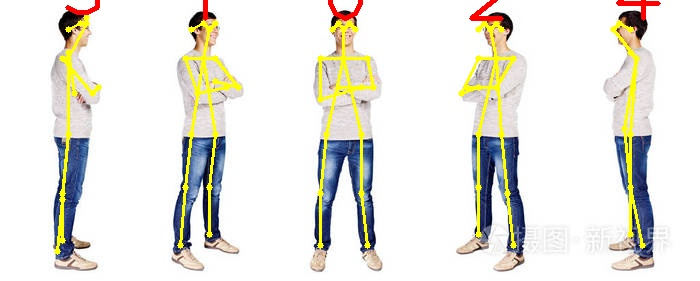

# lightweight-human-pose-estimation.OpenCV

This repository contains the inference code for the paper [Real-time 2D Multi-Person Pose Estimation on CPU: Lightweight OpenPose](https://arxiv.org/pdf/1811.12004.pdf).

We use the OpenCV library for the model inference, not including other library.

We use the model from [lightweight-human-pose-estimation.pytorch](https://github.com/Daniil-Osokin/lightweight-human-pose-estimation.pytorch) and rewrite the post processing code in c++ with OpenCV.

<p align="center">
  
</p>

## Requirements

* Ubuntu 20.04
* OpenCV (compile with CUDA)

## Demo
We provide demo just for the quick results preview. We only use one picture for show the result.
If you want, you can use the algorithm for videos or webcam.
* `mkdir build && cd build`
* `cmake .. && make && ./poseEstimation`

## Citation:

If this helps your research, please cite the paper:

```
@inproceedings{osokin2018lightweight_openpose,
    author={Osokin, Daniil},
    title={Real-time 2D Multi-Person Pose Estimation on CPU: Lightweight OpenPose},
    booktitle = {arXiv preprint arXiv:1811.12004},
    year = {2018}
}
```